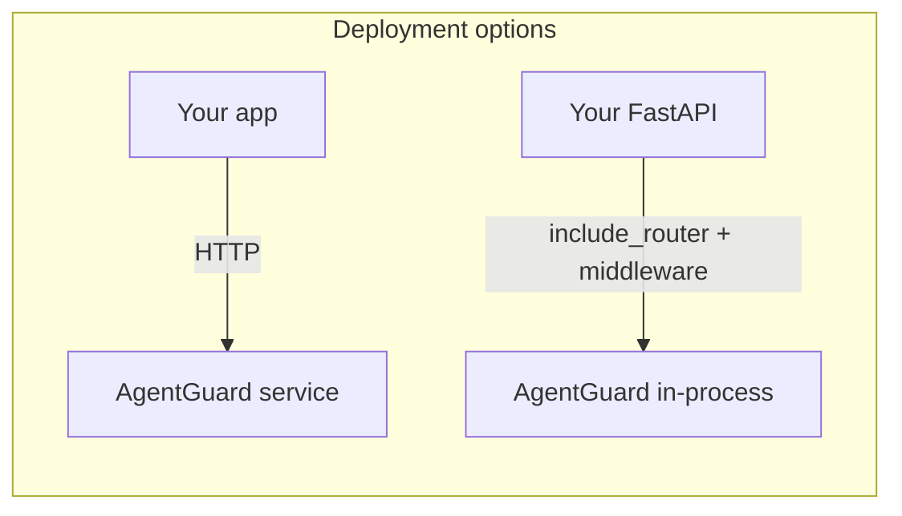

# Middleware & control-plane positioning

AgentGuard targets teams stuck between two extremes:

| Approach | Typical pain |
|----------|----------------|
| **Fragmented DIY** | Every service reinvents regex checks, inconsistent policies, no shared audit story |
| **Fully managed suites** | Cost, black-box behavior, hard to tune for your domain |

AgentGuard sits in the middle: a **self-hosted FastAPI app** (or **in-process** hooks) that exposes **one HTTP-shaped control plane** for input checks, output validation, policies, retrieval grounding, and action governance — heuristics you can read in code.

## In-process vs sidecar

- **Sidecar / standalone:** Run `uvicorn agentguard.main:app` and call `POST /v1/*` from your services.
- **In-process:** Mount routers and middleware from [`agentguard.integrations`](../../src/agentguard/integrations/fastapi.py) on your own `FastAPI()` app (see [README — Embed in your FastAPI app](https://github.com/MANIGAAA27/agentguard#embed-in-your-fastapi-app-in-process)).

## Honest scope

This is **not** a replacement for a vendor SOC or certified compliance tooling — see [Limitations](../index.md#limitations) and the README positioning paragraph. It **is** a practical layer for teams that want **boring JSON**, **parallel checks**, and **transparent logic**.

## Source

Community feedback: [DEV comment — Conway Research](https://dev.to/conwayresearch/comment/35p1m) · GitHub [#11](https://github.com/MANIGAAA27/agentguard/issues/11).
